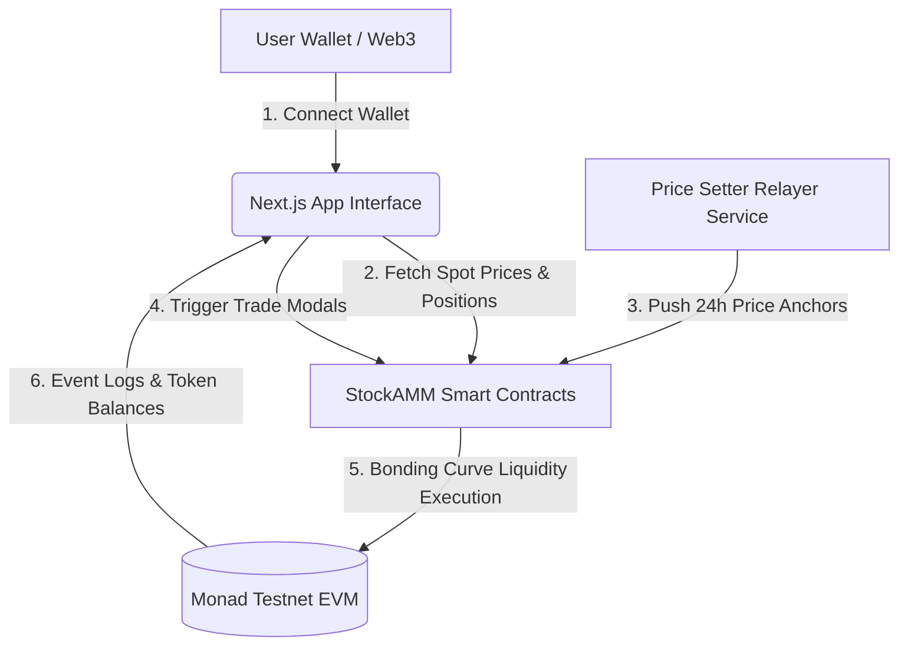
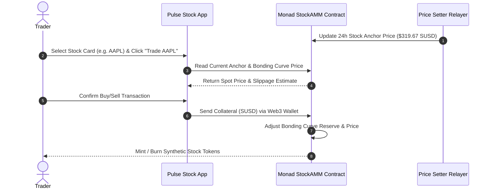

````markdown
# 📈 Pulse Stock | Synthetic Equities Protocol on Monad Testnet

**Pulse Stock** is a high-performance, Web3-native equity trading simulator deployed on the **Monad Testnet**. The platform bridges traditional equity markets with decentralized finance (DeFi) by pairing real-world 24-hour stock price anchors with on-chain bonding curve Automated Market Makers (AMMs). Traders can execute sub-second synthetic stock purchases ($AAPL, $TSLA,$NVDA, $GOOGL,$MSFT, $AMZN,$META, $COIN) backed by$sUSD collateral without order book delays.

---

## 🌐 Live Deployment & Network Details

| Property               | Details                                                                       |
| :--------------------- | :---------------------------------------------------------------------------- |
| **Live Web App**       | [https://pulse-stock-nu.vercel.app](https://pulse-stock-nu.vercel.app/)       |
| **Alternative Domain** | `monad-stock-sim.vercel.app`                                                  |
| **Target Network**     | Monad Testnet                                                                 |
| **Chain ID**           | `10143`                                                                       |
| **RPC URL**            | `https://testnet-rpc.monad.xyz`                                               |
| **GitHub Repository**  | [`PratyushGupta21/PulseStock`](https://github.com/PratyushGupta21/PulseStock) |

---

## 🚀 Key Features

- **⚡ Real-Time Price Anchors:** Integrates 24-hour market price anchors ($AAPL,$TSLA, $NVDA,$GOOGL, $MSFT,$AMZN, $META,$COIN) to benchmark synthetic token prices.
- **🔄 Dynamic Bonding Curve AMM:** Executes instant on-chain buy/sell swaps through contract-defined bonding curves on Monad.
- **📡 Autonomous Price Setter Service:** Includes a dedicated relayer service (`price-setter/`) that periodically fetches off-chain stock prices and posts anchor updates to smart contracts.
- **💼 On-Chain Portfolio Dashboard:** Tracks position values ($sUSD), token quantities held per stock, spot prices, and overall wallet balance in real time.
- **🎨 Cyber Glassmorphism UI:** Built with Next.js 14, Tailwind CSS, custom glassmorphism components, and dynamic ambient background video layers.
- **🏆 Social Trading & Leaderboard:** Tracks top-performing wallet addresses based on ROI, total portfolio growth, and execution volume.

---

## 🏗 System Architecture


````

---

## 📊 StockAMM Bonding Curve Workflow



---

## 🛠 Tech Stack & Tools

- **Frontend Framework:** Next.js 14+ (App Router, React 18, TypeScript)
- **Styling & Effects:** Tailwind CSS, Lucide React Icons, Glassmorphic UI containers, Full-screen background video layer
- **Smart Contracts:** Solidity, Foundry Framework (`contracts/script/Deploy.s.sol`, `contracts/test/StockAMM.t.sol`)
- **Oracle Relayer:** Node.js / TypeScript microservice (`price-setter/`)
- **Web3 Integration:** Ethers.js, Wagmi / Viem, Monad Testnet RPC
- **Deployment & CI/CD:** Vercel Hosting (`vercel.json`)

---

## 📂 Repository File Structure

```text
PulseStock/
├── app/                        # Next.js App Router root
│   ├── dashboard/              # Markets & Trade page (/dashboard)
│   ├── portfolio/              # User holdings & position values (/portfolio)
│   ├── leaderboard/            # User ROI rankings (/leaderboard)
│   ├── layout.tsx              # Root layout & providers wrapper
│   └── page.tsx                # Home / Landing page entry
├── components/                 # Reusable UI components
│   ├── dashboard/              # StockCard, TradeModal, TickerGrid
│   └── ui/                     # Translucent Cards, Navbar, Wallet Button
├── contracts/                  # Foundry Smart Contract Suite
│   ├── lib/                    # OpenZeppelin Dependencies
│   ├── script/                 # Deployment Scripts (Deploy.s.sol)
│   ├── test/                   # Contract Unit Tests (StockAMM.t.sol)
│   └── src/                    # StockAMM & Synthetic Token Solidity logic
├── price-setter/               # Autonomous Oracle Relayer
│   ├── index.ts                # Main execution loop
│   ├── package.json            # Relayer dependencies
│   └── .env.example            # Relayer environment configuration
├── public/                     # Static assets
│   └── hero-bg.mp4             # Red cyber ambient video background
├── vercel.json                 # Vercel deployment configuration
├── package.json                # Project root configuration
└── README.md                   # Project documentation

```

---

## ⚡ Local Development Setup

### 1. Prerequisites

- **Node.js:** `v18.x` or higher
- **Package Manager:** `npm`, `yarn`, or `pnpm`
- **Web3 Wallet:** MetaMask or Rabby configured for **Monad Testnet**

### 2. Installation Steps

```bash
# Clone the repository
git clone [https://github.com/PratyushGupta21/PulseStock.git](https://github.com/PratyushGupta21/PulseStock.git)
cd PulseStock

# Install root dependencies
npm install

```

### 3. Environment Setup

Create a `.env.local` file in the root directory:

```env
NEXT_PUBLIC_MONAD_RPC_URL="[https://testnet-rpc.monad.xyz](https://testnet-rpc.monad.xyz)"
NEXT_PUBLIC_CHAIN_ID="10143"
NEXT_PUBLIC_STOCK_AMM_ADDRESS="0xYourDeployedContractAddress"

```

### 4. Running Development Server

```bash
# Start Next.js frontend
npm run dev

```

Open [http://localhost:3000](https://www.google.com/search?q=http://localhost:3000) in your browser to test the platform.

### 5. Running the Price Setter Service (Optional)

```bash
cd price-setter
npm install
npm run dev

```

---
